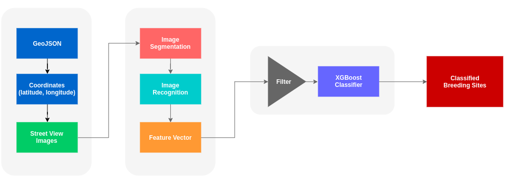

# Mosquito Breeding Sites Detector (Deprecated)

[](https://travis-ci.org/pcrete/Mosquito_Breeding_Sites_Detector) [](https://gitter.im/Mosquito_Breeding_Sites_Detector/Lobby)

This project is about detecting Dengue’s vectors breeding site from Google Street View images using deep learning. The main vector is Aedes Egypti mosquito.

## Table of contents

* Pipeline of process
* Description of Code
* Directory Structure
* Getting Started
    * [Prerequisites](#Prerequisites)
    * [Instalation](INSTALL.md)
    * [Running](scripts/README.md)
    * [Evaluating model accuracy](dataset/README.md)
* [Demo](demo/README.md)
* Built With

## Pipeline of process


## Code Description

#### All source codes are in scripts directory.

* `data_collection.py` used for retrieve google street view images of village that you want. The image size is 600x600 pixels.

* `image_recognition.py` used for recognize images , it will return top five classification results.

* `image_segmentation.py` used for extract segmented of image.

* `feature_vector_classification.py` used for classify the result of image recognition and image segmentation again for increasing more accuracy.

## Directory Structure
```
+Mosquito_Breeding_Sites_Detector
  +SegNet-Tutorial
  +caffe-segnet
  +GSV
  +xgboost
  +dataset
  +geojson
  +scripts
    +feature_vector
      -to_geojson.py
      -xgb_classifier.py
    +image_processing
      +model
      -image_divider.py
      -image_recognizer.py
      -inception.py
    +image_retreival
      -GSV_loader.py
      -get_village_points.py
      -polygon_to_points.py
    +segnet
      +Models
      -pysegnet.py
    -data_collection.py
    -image_recognition.py
    -image_segmentation.py
    -feature_vector_classification.py
  -README.md
  -INSTALL.md
```

## Getting Started <a name="Prerequisites"></a>

These instructions is about how you copy this project up and running on your local machine for development and testing purposes.

#### Prerequisites

* Python 2.7
* GPU card with CUDA Compute Capability 3.0 or higher [NVIDIA's documentation](https://developer.nvidia.com/cuda-gpus)
* [Install CUDA Toolkit 8.0](https://developer.nvidia.com/cuda-downloads)
* [Download cuDNN v5.1](https://developer.nvidia.com/cudnn)
* [Install TensorFlow with GPU](https://www.tensorflow.org/install/)
* [Install Caffe-Segnet with GPU](https://github.com/alexgkendall/caffe-segnet), caffe Installation ins [here](http://caffe.berkeleyvision.org/installation.html)

#### Installing

* see [Instalation instruction](INSTALL.md)

#### Running
* see [Running instruction](scripts/README.md)

#### Evaluating model accuracy
* see [Training model and Evaluation](dataset/README.md)

## Demo
* see [Demo](demo/README.md)

## Built With

* [TensorFlow](https://github.com/tensorflow/models) - Image Recognition
* [Caffe-Segnet](https://github.com/alexgkendall/caffe-segnet) - Image Segmentation
* [XGBoost](https://github.com/dmlc/xgboost) - Feature Vector Classifier
* [Overpass API](https://github.com/mvexel/overpass-api-python-wrapper) - Road/Street Geojson
* [Google Map API](https://developers.google.com/maps/) - Street View Image and Visualization
