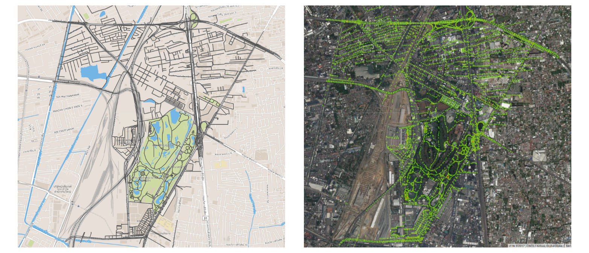

# Description
This is going to describe all of processes, start from very begining to the end of process.

## 1. Data Collection
### Step 0: Convert shape file to geojson file
Command line to convert .shp to .geojson [link to install](http://www.gdal.org/ogr2ogr.html)
* **input:** subdistrict.shp
* **output:** subdistrict.geojson

For example, 
```command
ogr2ogr -f GeoJSON output.geojson input.shp
```
### Step 1: Convert polygon's subdistrict to points/coordinate
`image_retreival/polygon_to_points.py`
* **input:** subdistrict.geojson, province, district, and subdist
* **output:** points/coordinate of subdistrict

### Step 2: Extract village points from subdistrict points
`image_retreival/get_village_points.py`
* **input:** points of subdistrict
* **output:** points of village



### Step 3: Load Google Street View Image from village points
`image_retreival/GSV_loader.py`
* **input:** points of village
* **output:** street view images


## 2. Data Processing
### Step 1: Classify image
* **input:** street view images
* **output:** features vector (.csv)

### Step 1a: Image Segmentation
`image_segmentation.py`

* **input:** google street view images
* **output:** segmented image


### Step 1b: Image Recognition
`image_recognition.py`

* **input:** street view and segmented images
* **output:** top-5 classification results (.csv)


### Combined Segmentation and Recognition


### Step 2: Features Vector Classification
* **input:** features (.csv)
* **output:** classification results (.csv)

** Example of classification results **

| Image name | 1st result | 1st score | 2nd result | 2nd score | 3rd result | 3rd score | 4th result | 4th score | 5th result | 5th score |
| --- | --- | --- | --- | --- | --- | --- | --- | --- | --- | --- |
| 15.38203756895384-100.1636399994293-120-2013-09-5-Tree | lakeside, lakeshore | 0.2218 | worm fence | 0.110338 | swing | 0.0501 | golf ball| 0.0215 | golfcart, golf cart | 0.0179|
|8.076112623778412-98.83164102093671-240-2016-03-12-Pavement|pot, flowerpot|0.22256|sundial|0.0321534|mortar|0.0310492|caldron, cauldron|0.0249833|Dutch oven|0.0229676|
|8.078046220141706-98.85250783470164-240_2016-03-8-Fence|greenhouse|0.28458|steel arch bridge|0.0468726|worm fence|0.0316026|valley, vale|0.0296596|seashore, coast|0.015028


## 3. Data Visualization

### Step 1: Generate geojson from classification result
`feature_vector/feature_vector_classification.py`
* **input:** classificatino results (.csv)
* **output:** geojson (.js)

### Step 2: Visualize on map
`GSV/../../../visulization.py`
* **input:** geojson (.js)
* **output:** map visualization


# How to run
Assuming you have installed all of require libraries in [Installing](../install.md), simply run

* ## Data Collection
```command
python data_collection.py --province PROVINCE --district DISTRICT --subdist SUBDIST --village VILLAGE
```
* ## Data Processing
```command
python image_recognition.py --province PROVINCE --district DISTRICT --subdist SUBDIST --village VILLAGE
```
```command
python image_segmentation.py --province PROVINCE --district DISTRICT --subdist SUBDIST --village VILLAGE
```
```command
python feature_vector_classification.py --province PROVINCE --district DISTRICT --subdist SUBDIST --village VILLAGE
```
